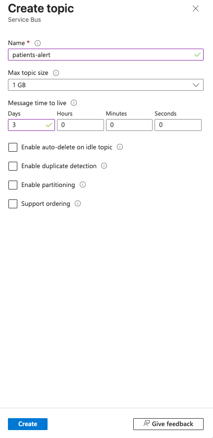

# Service Bus 개요

## Azure Service Bus

Azure Service Bus는 메시지 큐와 게시-구독 토픽이 있는 완전 관리형 엔터프라이즈 메시지 브로커입니다.

[Microsoft Document](https://learn.microsoft.com/ko-kr/azure/service-bus-messaging/service-bus-messaging-overview)

## 환경설정 및 개발

### 1. Service Bus 인스턴스 생성

리소스 그룹에 Azure Service Bus를 생성합니다.

### 2. Topic 생성

Topic은 아래 화면과 같이 Azure Cloud에서 생성합니다.
보안을 위해 보존 기간은 임의로 3일로 지정합니다.


위와 같은 방식으로 각각 아래와 같이 생성합니다.

| 토픽 명칭           | 송신자 (Publisher) | 수신자 (Subscriber)  | 주요 내용                                 |
| ------------------- | ------------------ | -------------------- | ----------------------------------------- |
| emc-patient-alert   | 현장 클라이언트    | 모든 의료 센터       | "신규 환자 발생 정보, 환자 상태 업데이트" |
| center-responses    | 의료 센터          | 해당 현장 클라이언트 | 센터별 수용 가능 여부 (Approve / Reject)  |
| emc-patient-confirm | 현장 클라이언트    | 모든 의료 센터       | 특정 센터로의 이송 확정 알림 (상황 종료)  |

#### AzureCLI로 빠르게 구성

```bash
TOPICS=(
    "emc-patient-alert" "center-responses" "emc-patient-confirm"
)

for TOPIC in "${TOPICS[@]}"
do
    echo "Creating topic: $TOPIC..."
    az servicebus topic create \
        --resource-group MyResourceGroup \
        --namespace-name MyNamespaceName \
        --name "$TOPIC"
done
```

### 3. Subscribe 생성

#### Azure CLI로 빠르게 생성

```bash
# 변수 설정
RESOURCE_GROUP="your-resource-group"
NAMESPACE_NAME="your-servicebus-namespace"
TOPIC_NAME="emc-patient-alert"

declare -A regions
regions=(
    ["seoul"]="Seoul"         # 서울
    ["incheon"]="Incheon"       # 인천
    ["gyeonggi"]="Gyeonggi"     # 경기
    ["gangwon"]="Gangwon"       # 강원권
    ["chungcheong"]="Chungcheong" # 충청권
    ["honam"]="Honam"           # 호남권
    ["yeongnam"]="Yeongnam"      # 영남권
)

for sub_name in "${!regions[@]}"; do
    region_val=${regions[$sub_name]}
  
    echo "Creating subscription: $sub_name for Region: $region_val"
  
    az servicebus subscription create \
        --resource-group $RESOURCE_GROUP \
        --namespace-name $NAMESPACE_NAME \
        --topic-name $TOPIC_NAME \
        --name $sub_name

    # 기본 필터($Default) 삭제
    az servicebus subscription rule delete \
        --resource-group $RESOURCE_GROUP \
        --namespace-name $NAMESPACE_NAME \
        --topic-name $TOPIC_NAME \
        --subscription-name $sub_name \
        --name '$Default'

    # 권역별 SQL 필터 생성 (RegionGroup 속성 기준)
    az servicebus subscription rule create \
        --resource-group $RESOURCE_GROUP \
        --namespace-name $NAMESPACE_NAME \
        --topic-name $TOPIC_NAME \
        --subscription-name $sub_name \
        --name "filter-$region_val" \
        --filter-sql-expression "Region = '$region_val'"
done

echo "Creating national subscription: sub-national"
az servicebus subscription create \
    --resource-group $RESOURCE_GROUP \
    --namespace-name $NAMESPACE_NAME \
    --topic-name $TOPIC_NAME \
    --name "all"
```
